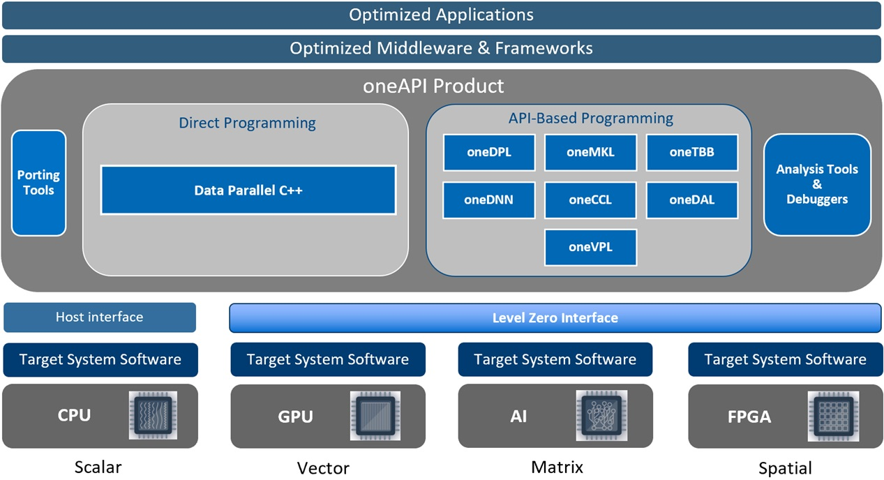

# Intel oneAPI Project

## Introduction

[oneAPI](https://www.oneapi.io/) is an open, standards-based programming model developed by Intel. It is designed to simplify programming across different types of computing architectures, including CPUs, GPUs, FPGAs, and other accelerators.

The goal of [oneAPI](https://www.oneapi.io/) is to provide developers with a unified and cross-architecture programming model, for faster application performance, more productivity, and greater innovation.

## oneAPI projects

This project aims to provide a full oneAPI software stack in openEuler ecosystem.

### oneAPI Level Zero

- Upstream: https://github.com/oneapi-src/level-zero
- Version: 1.13.1
- openEuler: https://gitee.com/src-openeuler/level-zero

### Intel(R) Graphics Memory Management Library

- Upstream: https://github.com/intel/gmmlib
- Version: 22.3.10
- openEuler: https://gitee.com/src-openeuler/intel-gmmlib

### Intel(R) Graphics Compiler

- Upstream: https://github.com/intel/intel-graphics-compiler
- Version: 1.0.14828.26
- openEuler: https://gitee.com/src-openeuler/intel-graphics-compiler

### Intel(R) ME TEE Library

- Upstream: https://github.com/intel/metee
- Version: 3.1.5
- openEuler: https://gitee.com/src-openeuler/intel-metee

### Intel(R) Graphics System Controller Firmware Update Library

- Upstream: https://github.com/intel/igsc
- Version: 0.8.9
- openEuler: https://gitee.com/src-openeuler/intel-gsc

### Intel(R) C for Metal Compiler
- Upstream: https://github.com/intel/cm-compiler
- version: 1.0.144
- openEuler: https://gitee.com/src-openeuler/intel-cm-compiler

### Intel(R) Graphics Compute Runtime

- Upstream: https://github.com/intel/compute-runtime
- version: 23.30.26918.50
- openEuler: https://gitee.com/src-openeuler/intel-compute-runtime
